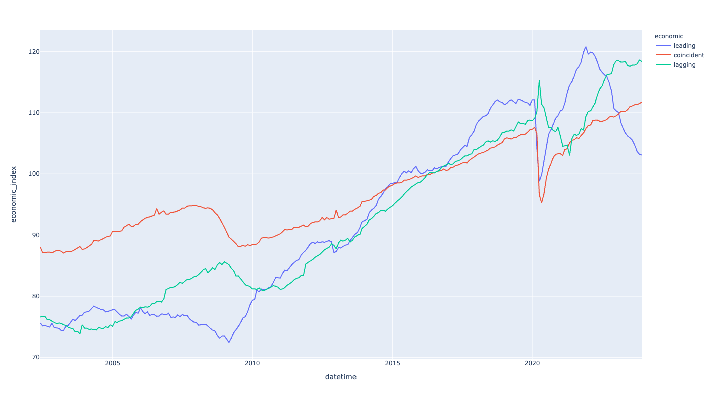

# The Conference Board Economic Index

## Economic Index Plot
https://kuiming.github.io/economic_index/economic_index.html

## Leading Economic Index

### Implications
- Rising: An increase in leading indicators usually suggests that future economic activity will rise. This could mean that the economy is entering an expansion phase, with increased business and consumer confidence, leading to higher investment and consumption.
- Falling: A decrease in leading indicators may indicate a reduction in economic activity, suggesting potential risks of an economic downturn. This could lead to decreased business and consumer confidence and reduced investment and consumption.

### Leading Economic Index Components
- Average weekly hours in manufacturing;
- Average weekly initial claims for unemployment insurance; 
- Manufacturers’ new orders for consumer goods and materials; 
- ISM® Index of New Orders; 
- Manufacturers’ new orders for nondefense capital goods excluding aircraft orders;
- Building permits for new private housing units; 
- S&P 500® Index of Stock Prices; 
- Leading Credit Index™; 
- Interest rate spread (10-year Treasury bonds less federal funds rate); 
- Average consumer expectations for business conditions.

## Coincident Economic Index

### Implications
- Rising: A rise in coincident indicators indicates that current economic activity is increasing. This usually signifies a healthy economy, with potential increases in employment levels and personal income, showing current economic expansion.
- Falling: A fall in coincident indicators indicates a reduction in current economic activity, possibly meaning the economy is entering or already in a recession, with potential decreases in employment and income levels.
Considered Factors: Coincident indicators typically include employment figures, personal income, industrial production, and retail sales.

###  Coincident Economic Index Components
- payroll employment, 
- personal income less transfer payments, 
- manufacturing and trade sales, 
- industrial production
These are included among the data used to determine recessions in the US.

## Lagging Economic Index

### Implications
- Rising: An increase in lagging indicators usually confirms past economic expansion. The rise in these indicators might reflect that the economy has been in a growth phase for some time, such as through increased corporate profits and reduced unemployment rates.
- Falling: A decrease in lagging indicators may confirm the occurrence of an economic recession. This could indicate that the economy has been in a downturn for some time, reflected in decreased corporate profits and increased unemployment rates.

### Lagging Economic Index Components
- Average duration of unemployment
- Ratio, manufacturing and trade inventories to sales (in 1996 $)
- Change in labor cost per unit of output, manufacturing
- Average prime rate charged by banks
- Commercial and industrial loans outstanding (in 1996 $)
- Ratio, consumer installment credit outstanding to personal income
- Change in Consumer Price Index for services.

## Reference

- [Description of Components](https://www.conference-board.org/data/bci/index.cfm?id=2160)
- [US Leading Indicators](https://www.conference-board.org/topics/us-leading-indicators)